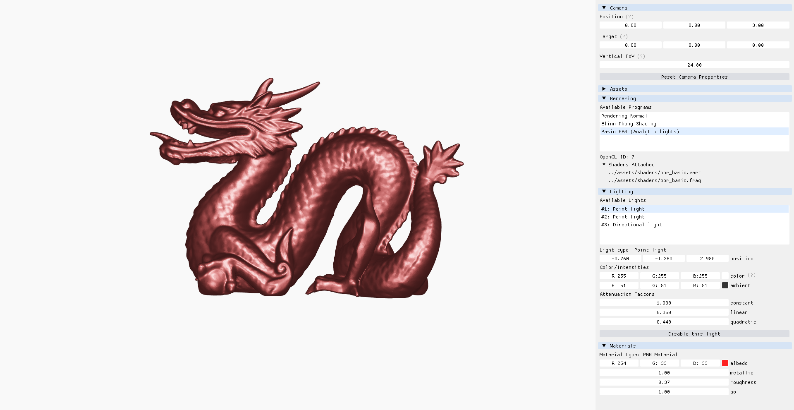

# OpenGL Mesh Viewer

Hongyu ZHAI ([Github](https://github.com/iamzhaihy), [LinkedIn](https://www.linkedin.com/in/hongyu-zhai-34b961139/))



## About this Project
When I was learning to program shaders, I almost always spent more time on setting up the environment. OpenGL requires a lot of boilerplate code to work, and some third-party libraries are necessary to do the heavy lifting. To enable faster shader development, I wrote this project. It does the preparation for you, so the user can focus on implementing exciting rendering algorithms.

## Compile and Run
Before you start, make sure you have the following things:
- CMake 3.15+
- A C++ compiler for your platform
- Hardware that supports modern OpenGL

To run the program yourself, type the following commands
```bash
git clone --recursive https://github.com/iamzhaihy/hzgl-mesh-viewer.git
cd hzgl-mesh-viewer
mkdir build && cd build
cmake ..
cmake --build .
```

The external libraries are all compiled statically, which means it should work out of the box if you have the things above.

## Basic Controls

Using the GUI, the user can:

- Tweak camera settings by clicking and dragging the widgets in the "Camera" section
- Switch between available models by clicking on an item in the "Available Models" list
- Switch between shader programs by clicking on an item in the "Available Programs" list
  - Tweak additional rendering settings (if available) via the widgets

Several keyboard shortcuts are provided:

- Press `Q` or `Escape` to quit the program
- Press `F` or `PrintScreen` to take a screenshot (will be stored in the same directory as the executable)

## Current Features

**Easy-to-use helper functions**

During the process, I wrote several helper functions to make things easier. For example:
```c++
// src/hzgl/FileSystem.hpp
bool Exists(const std::string& filename);
```

```c++
// src/hzgl/Mesh.hpp
typedef struct
{
    // Metadata
    std::string name;

    // Geometry
    int num_vertices;
    std::vector<float> positions;
    std::vector<float> normals;
    std::vector<float> texcoords;
    std::vector<unsigned> indices;

    // Material
    ShadingMode shading_mode;
    std::unordered_map<std::string, std::string> texpath;
} MeshInfo;

void LoadMeshesFromFile(const std::string &filepath, std::vector<MeshInfo> &meshes);
```

```c++
// src/hzgl/Shader.hpp
typedef struct
{
    GLenum type;
    std::string filepath;
    GLuint id;
} ShaderStage;

GLuint CreateShaderProgram(std::vector<ShaderStage> stages, std::vector<const char*> feedbackVaryings={});
```

I also added several helper classes. One of them is `ResourceManager`. It will check to make sure the same file does not get loaded twice. It will also release the resources when it is out of scope. For more detail please check out `/src/hzgl/ResourceManager.hpp`.

```c++
hzgl::ResourceManager resources;
std::vector<hzgl::RenderObject> objects;

// load meshes from OBJ files
resources.LoadModel("../assets/models/bunny.obj", objects);

// load and create shader program from source files
resources.LoadShaderProgram({
    {GL_VERTEX_SHADER, "../assets/shaders/phong.vert"},
    {GL_FRAGMENT_SHADER, "../assets/shaders/phong.frag"},
    }, "Blinn-Phong Shading");
```
I am also planning to make `hzgl` a standalone library. More on that later.

**Interactive UI for Faster Debugging**

This project incorporated [Dear ImGui](https://github.com/ocornut/imgui) to make debugging easier. The user can tweak the camera properties using the tools in the first section.


As mentioned before, it is easy to switch between loaded OBJ files. When developing shaders, this can be very helpful. For example, If the shader works on the first mesh but does not work on the second, then the surface normal of the second mesh might be incorrect. It also shows useful info (e.g., OpenGL VAO, number of vertices) of the selected model.


It is also easy to switch between shader programs. Depending on the selected shader program, additional options may pop up. The following GIF shows the options available for Blinn-Phong Shading.


As shown above, the user can tweak the lighting properties of the environment and the material properties of the model. The following GIF shows the options for basic PBR shading.


## Future Plans for the Project

Here is my plan for the future improvement

- More sample meshes
  - Add more OBJ files from [McGuire Computer Graphics Archive](http://casual-effects.com/data/index.html)
- More rendering methods
  - Bump, Normal, and Parallax mapping 
  - Physically Based Rendering
    - [x] Simple model with uniform metallic, roughness, and ao value
- Improve mesh loading code
  - [x] Handle OBJ files with more than 1 shape
  - [ ] Handle OBJ files with smoothing groups
  - [ ] Handle OBJ files with missing info (missing normals, TBN, etc.)
  - [ ] A better way to determine texture types (OBJ was made before PBR and 3D artists are not consistent)
- Improve interactive UI
  - [ ] Load model files from a dropdown file menu
  - [ ] Add a simple editor that recompiles shaders after the user saves changes
- Improve helper functions
  - [x] Add fallback options if C++ 17 is not supported
  - [x] Support more file formats (add [tinygltf](https://github.com/syoyo/tinygltf) or switch to [ASSIMP](https://github.com/assimp/assimp))
